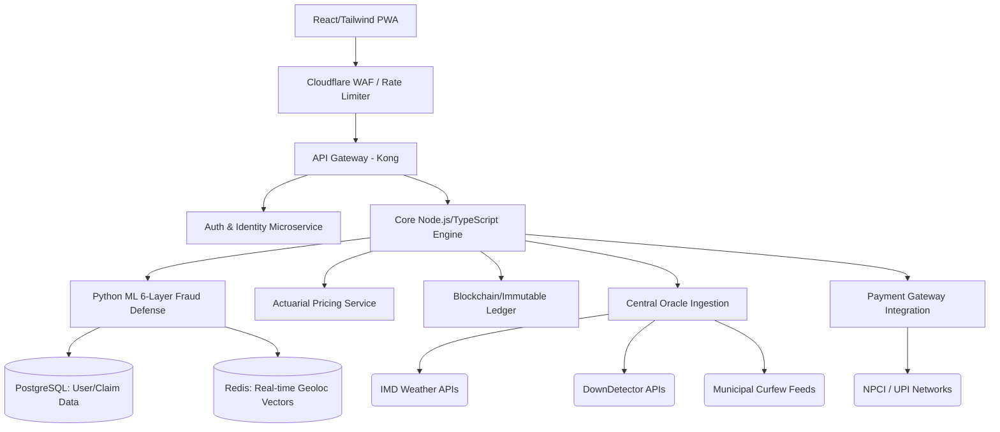

# InsureFlow System Architecture (Guidewire DEVTrails 2026)

This document outlines the high-level system architecture, data flow diagrams, security topologies, and Phase 2 scalability plans for the InsureFlow parametric insurance platform. While the Hackathon MVP is heavily front-end weighted in React (`InsureFlow.jsx`), this document defines the target end-state enterprise topography.

***

## 1. Top-Level System Architecture Diagram (Phase 2 & Beyond)

The InsureFlow architecture splits into 7 distinct layers: Client, Edge Defense, API Gateway, Orchestration/Logic, Data Persistence, ML/Intelligence, and External Oracles.



***

## 2. Platform Data Flow Diagrams

### 2.1 User Registration Flow
1. **Initiation**: The user subits a mobile number via React UI.
2. **Fingerprinting**: The browser's Canvas fingerprint, hardware concurrency, and user-agent string are hashed to generate a unique `DeviceTraceID`.
3. **Verification**: SMS OTP is fired via Twilio/Msg91 (Simulated in MVP).
4. **Ingestion**: The backend creates `UserProfile` and initializes a `RiskScore` of 0.1. A background worker begins importing 30-day historical Google location timeline data if permissions are granted.

### 2.2 Dynamic Policy Creation Flow
1. The user navigates to the 'Protect' CTA.
2. `PricingEngine` polls `PostgreSQL` for the user's `ZoneTier` (1-4).
3. `PricingEngine` assesses `recentClaims` against dynamic weather datasets to calculate the seasonal beta.
4. Final premium is presented (₹15 - ₹70).
5. User agrees via Razorpay/Stripe subscription mandate.
6. Record written to `Immutable Ledger`. Status shifts to `ACTIVE`.

### 2.3 Parametric Claim Triggering Flow (Zero-Touch)
1. **Oracle Breach**: Ext1 (Weather API) detects Rainfall > 50mm in 'Indiranagar'.
2. **Querying Active Policies**: `CoreLogic` queries DB for all active policies where `Zone == 'Indiranagar'`.
3. **Draft Event Generation**: Draft claims are generated for 400 riders.
4. **Push Notification**: React Native bridge/PWA pushes a silent payload forcing the app to transmit live GPS.
5. **Fraud Pipeline Execution**: Handed off to `FraudEngine`.

### 2.4 Fraud Pipeline (6-Stage Pipeline)
*   **Stage 1 Pipeline**: GPS bounds checking against 30-day historical. `HaversineDistance()`
*   **Stage 2 Pipeline**: Active checking for `/system/xbin/su` (Root check) and Mock Locations setting enabled.
*   **Stage 3 Pipeline**: Time-series check querying previous claim timestamps.
*   **Stage 4 Pipeline**: Graph Database (Neo4j/Supabase) cluster mapping checking for IP overlaps (Sybil attack prevention).
*   **Stage 5 Pipeline**: Z-score analysis of tap duration vs historical averages.
*   **Stage 6 Pipeline**: Optional escalation to manual verification (Video face match).

***

## 3. TypeScript Interfaces & Data Models

These models act as the absolute source of truth across the platform.

```typescript
export interface UserProfile {
  userId: string;         // UUIDv4
  name: string;
  phone: string;          // E.164 format
  zone: 'Whitefield' | 'Indiranagar' | 'Koramangala' | 'MG Road' | 'Jayanagar' | 'Outer Ring Road';
  platform: 'Zomato' | 'Swiggy' | 'Zepto' | 'Dungo' | 'Amazon';
  weeklyEarnings: number; // Integer representation in INR
  fraudRiskScore: number; // Float 0.00 to 1.00
  primaryDeviceId: string;
  historicalLocations: Array<{ lat: number, lng: number }>;
  policies: Policy[];
  claims: Claim[];
}

export interface Policy {
  id: string;
  status: 'ACTIVE' | 'EXPIRED' | 'REVOKED';
  premiumPaid: number;
  maxPayout: number;
  startDate: string;      // ISO 8601 string
  endDate: string;
}

export interface Claim {
  id: string;
  disruptionType: 'Severe Rain (Monsoon)' | 'Lethal Heatwave' | 'Hazardous AQI' | 'Civic Curfew' | 'Platform Crash';
  amount: number;
  timestamp: string;
  lat: number;
  lng: number;
  ip: string;
  deviceInfo: {
    isRooted: boolean;
    mockLocationEnabled: boolean;
    deviceId: string;
  };
  interactionZScore: number;
  status: 'APPROVED' | 'UNDER_REVIEW' | 'REJECTED';
  fraudAnalysis?: FraudReport;
}

export interface FraudReport {
  totalScore: number;
  breakdown: {
    geofence: number;
    deviceCheck: number;
    temporal: number;
    network: number;
    behavioral: number;
    proofOfLife: number;
  };
  decision: 'auto-approve' | 'manual-review' | 'reject';
}
```

***

## 4. API Endpoints Reference (Target State)

Assuming a V2 RESTful migration:

| Method | Endpoint | Purpose | Latency Target |
| :--- | :--- | :--- | :--- |
| `POST` | `/v1/auth/verify` | Device auth + Fingerprinting. | < 200ms |
| `GET` | `/v1/users/{id}/premium` | Requests the `PricingEngine` dynamic rate. | < 300ms |
| `POST` | `/v1/policies/activate` | Process UPI mandate + issue coverage logic. | < 800ms |
| `POST` | `/v1/claims/simulate` | Test endpoint to fire fake Oracle payloads. | < 150ms |
| `POST` | `/v1/claims/disrupt` | Internal webhook from Oracles signaling a breach. | < 50ms |
| `GET` | `/v1/analytics/fleet` | Hydrates Recharts matrices for macro-view. | < 400ms |

***

## 5. Security Architecture

### 5.1 TLS / Network Security
All external communication is enforced via TLS 1.3 exclusively. The Oracle APIs communicate with the system using mTLS (mutual TLS) to prevent Oracle-spoofing attacks (e.g. an attacker faking a weather API request).

### 5.2 Device Security
Mobile clients utilize aggressive device pinning. For every `POST /claims`, a cryptographic payload signed by the device's secure enclave (Keychain/Keystore) is embedded as a bearer JWT checking for hardware tampering.

### 5.3 Payload Encryption
The `deviceInfo` JSON is heavily encrypted via AES-256 before transmission from the browser client to prevent man-in-the-middle proxy interception (e.g., Charles Proxy) designed to rewrite coordinates mid-flight.

***

## 6. Performance Engineering Targets

To ensure gig workers—often operating on 3G networks or low-memory Android devices—can utilize the app consistently:

*   **Initial Load Time**: < 1.8 seconds (via Vercel Edge caching).
*   **Time to Interactive (TTI)**: < 2.5 seconds on a simulated "Slow 3G" connection.
*   **Fraud Detection Engine Execution Rate**: The entire 6-Layer check sequence must resolve mathematically in **< 100 milliseconds**. (Accomplished via localized class logic in `InsureFlow.jsx` for the Hackathon).
*   **Bundle Size Target**: React + Recharts + Tailwind logic compressed to < 800kb via Vite Tree-shaking.

***

## 7. Scalability Roadmap Matrix

### Phase 1: MVP / DEVTrails Hackathon (Current)
*   React 18 logic.
*   In-memory state management coupled with `localStorage`.
*   6-Layer algorithmic defense locally resolved.
*   Simulated Oracle pulls via UI interactions.

### Phase 2: Pilot Rollout (Multi-User)
*   Node.js backend introduction.
*   PostgreSQL state transition.
*   Twilio OTP validation.
*   Razorpay payment gateway activation locking real capital.

### Phase 3: High Scale (100,000+ Active Users)
*   TensorFlow / PyTorch implementation for Fraud Layers 1, 3, 5. Replace deterministic `Z-Scores` with deep neural analysis.
*   Kafka event stream replacing standard REST endpoints for handling massive simultaneous Oracle weather breaks.

### Phase 4: Enterprise Expansion (8M+ Fleet)
*   Proprietary physical weather sensors on delivery boxes feeding direct proprietary data vs IMD APIs.
*   Expanding disruption classes to extreme health anomalies (heart rate spikes via smartwatch telemetry).
